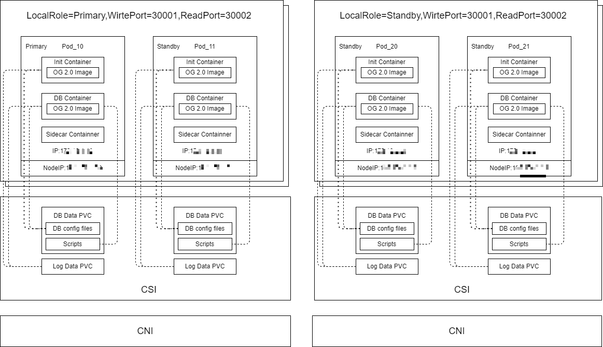
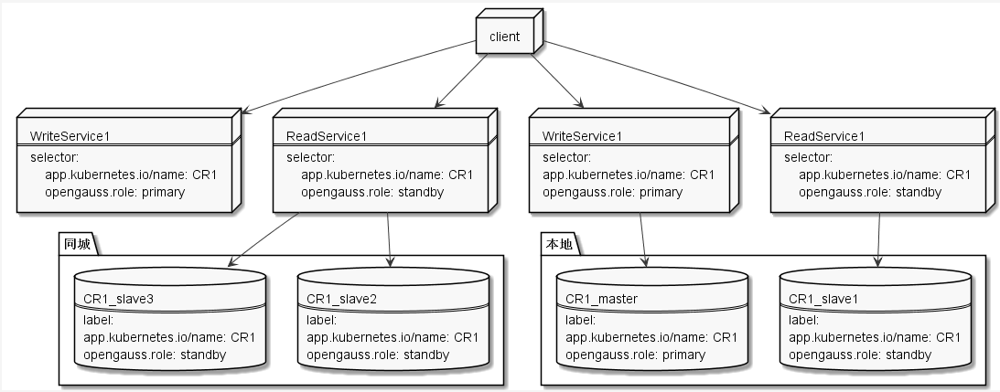
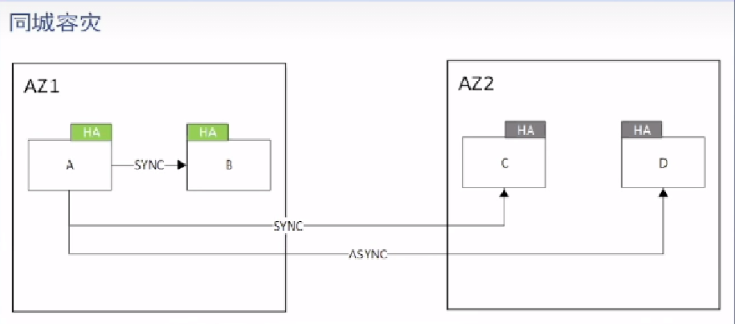
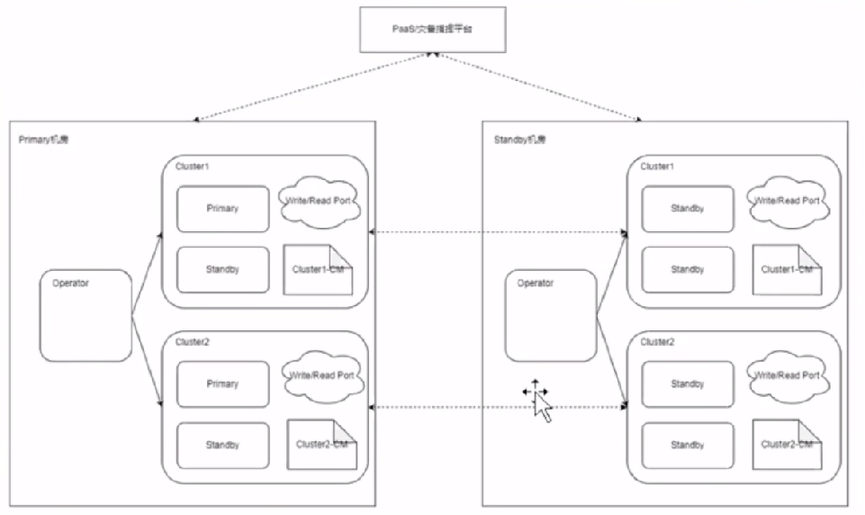
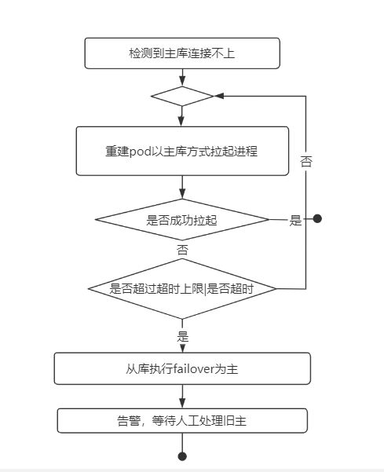

+++
title = "***openGauss operator初探***"
date = "2023-04-10"
tags = ["openGauss operator初探"]
archives = "2023-04"
author = "xucheng"
summary = "openGauss operator初探"
times = "11:30"
+++


## ***openGauss operator初探***
### 介绍
OpenGauss operator是由OpenGauss社区开源的opeator项目，目前已在多个实际场景落地。OpenGauss operator 是一个基于Kubernetes管理的OpenGauss集群安装与维护的工具，其功能主要包括数据库集群的安装部署、维护、拓扑保持、资源升级、水平扩缩容、同城切换等全生命周期管理。

1.整理架构



2.读写分离



读写分离设计是基于servcie和pod 添加label实现的 operator会给OpenGauss集群下的主、备pod角色添加对应角色的label。其中角色为主的节点，Pod的label为primary；角色为备的节点，Pod的label为standby。然后通过读写servcie根据labels映射到不同的pod，其中读service会映射到所在k8s集群OpengGauss集群下所有备节点所在的Pod，写service会映射到所在k8s集群OpengGauss集群主节点所在的Pod，客户端通过访问k8s集群的任一Node的ip+service的Nodeport，从而实现读写分离。

### 使用
1. 资源定义
创建crd属性参考如下


| 属性名称           | 属性类型        | 属性说明                   |
| :------------- | :---------- | :--------------------- |
| ReadPort       | Int         | NodePort读端口            |
| WritePort      | int         | NodePort写端口            |
| DBPort         | int         | OpenGauss实例端口          |
| Image          | string      | OpenGauss镜像地址          |
| LocalRole      | string      | 集群角色 ：primary /standby |
| CPU            | string      | OpenGauss实例CPU限额       |
| Storage        | string      | OpenGauss实例存储限额        |
| Memory         | string      | OpenGauss实例内存限额        |
| BandWidth      | string      | 带宽                     |
| IpList         | IpNodeEntry | Opengauss实例的IP和工作节点名称  |
| RemoteIpList   | \[]string   | 同城集群的实例IP列表            |
| BackupPath     | string      | 本地备份路径                 |
| ArchiveLogPath | string      | 本地归档路径                 |
| HostpathRoot   | string      | 本地存储路径(使用本地存储时填写)      |
| StorageClass   | string      | 存储插件类型                 |
| SidecarImage   | string      | Sidecar镜像地址            |
| SidecarCPU     | string      | Sidecar CPU限额          |
| SidecarMemory  | string      | Sidecar内存限额            |
| SidecarStorage | string      | Sidecar存储限额            |
| Maintenance    | bool        | 集群维护模式                 |
| ScriptConfig   | string      | 执行脚本的配置                |
| FilebeatConfig | string      | Filebeat配置CM           |


2.部署
operator支持三种部署模式:

* 单节点
* 主从模式，支持一主多从
* 同城部署模式

下图为例，使用一主三从，其中同城机房有一个同步备节点，保证数据准确性。同城部署两个k8s集群，分别部署对应operator。其中本地中心集群需设置LocalRole为primary，同城中心设置LocalRole为standby，本地中心指定remoteIpList为同城ip节点。





3.扩容、迁移
OpenGauss 集群的扩容是通过修改CR的iplist属性来实现的，即：

```
iplist:
  - ip: *.*.0.5
    nodename: node1
扩容即新增iplist的一个元素，通过调整OpenGauss的iplist，例如：
iplist:
  - ip: *.*.0.2
    nodename: node2
  - ip: *.*.0.5
    nodename: node1
```

更新配置文件后对集群重新进行部署
kubectl apply -f cluster.yaml

4.诊断、监控

1）集群故障时，operator支持故障处理。其中本地节点故障发生时（以primary为例），故障节点尝试自动拉起，当拉起次数达到上限，会进行节点切换，本地集群不可用时需要手动切换至同城机房。



2）OpenGauss进程容器中使用通过sidecar方式采集OpenGauss日志，支持es日志采集，定时任务

5.运行维护、升级
operator支持资源修改已有集群的内存，CPU,带宽，存储容量等大小。其中多节点情况下，升级后会发生主从切换。

6.备份、归档
operator提供data,backup等volume，支持gs_basebackup备份，归档操作

7.资源回收
删除OpenGauss集群，只需要执行k8s命令删除cr即可。需要注意的是，删除OpenGauss集群后，该CR的pvc仍然存在，以防止需要恢复数据。

kubectl delete opengaussclusters.opengauss.sig -n <namespace name> <cr name> 

项目地址https://gitee.com/opengauss/openGauss-operator
其他参考资料https://www.bilibili.com/video/BV1HB4y1Q7VX/?share_source=copy_web&vd_source=2300d58b192049348b003ca286486fd3