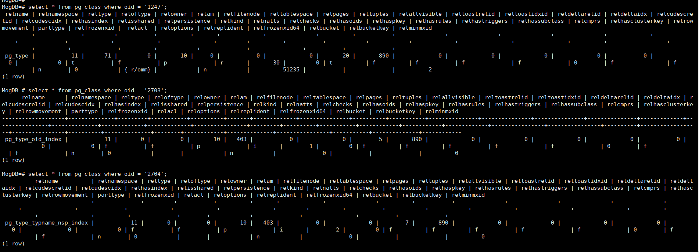

+++

title = "openGauss/MogDB的uncommitted xmin问题解决" 

date = "2022-12-06" 

tags = ["MogDB", "openGauss"] 

archives = "2022-12" 

author = "云和恩墨-阎书利" 

summary = "openGauss/MogDB的uncommitted xmin问题解决"

img = "/zh/post/ysl/title/img39.png" 

times = "10:20"
+++

本文出处：[https://www.modb.pro/db/568608](https://www.modb.pro/db/568608)

# 一、问题现象

在测试openGauss/MogDB的时候，发现主库查询snapshot.tables_snap_timestamp这个表的时候，一select *，数据库就宕机，而备库是正常的。因为是测试环境不存在数据量太多的情况。所以最开始初步怀疑有数据页损坏了。


在分析的时候，因为是测试环境使用了vacuum full去测试（正常使用vacuun freeze应该就可以）。


报错为**ERROR: uncommitted xmin 21506 from before xid cutoff 51237 needs to be frozen**

通过返回结果猜测数据库在已经不允许执行事务的情况下被回滚的, 所以显示为**uncommitted xid**。
根据vacuum full提示，它跳过了pg_type表，并且建议我们用**maintenance模式**去vavuum full处理它。
此外我们根据提示的xmin可以找到对应的是pg_type以及两个索引。





# 二、问题解决

maintenance模式类似于PostgreSQL的单用户模式。但是比较好的一点是，MogDB/openGauss的maintenance模式不需要PostgreSQL那样需要停掉PostgreSQL数据库再去使用。关于PostgreSQL的单用户模式可以参考我这一篇 https://www.modb.pro/db/142632

## 1.使用maintenance模式连接数据库

以下两种方法均可。

方式一

```
gsql -d postgres -p 26000-r -m
```

方式二

```
gsql -d postgres -p 26000 -r
连接成功后，执行如下命令：
set xc_maintenance_mode=on;
```

## 2.使用vacuum freeze/vacuum full处理该系统表

正常使用vacuun freeze应该就可以。


再使用正常方式登录，去查询这个表。问题得以解决。

